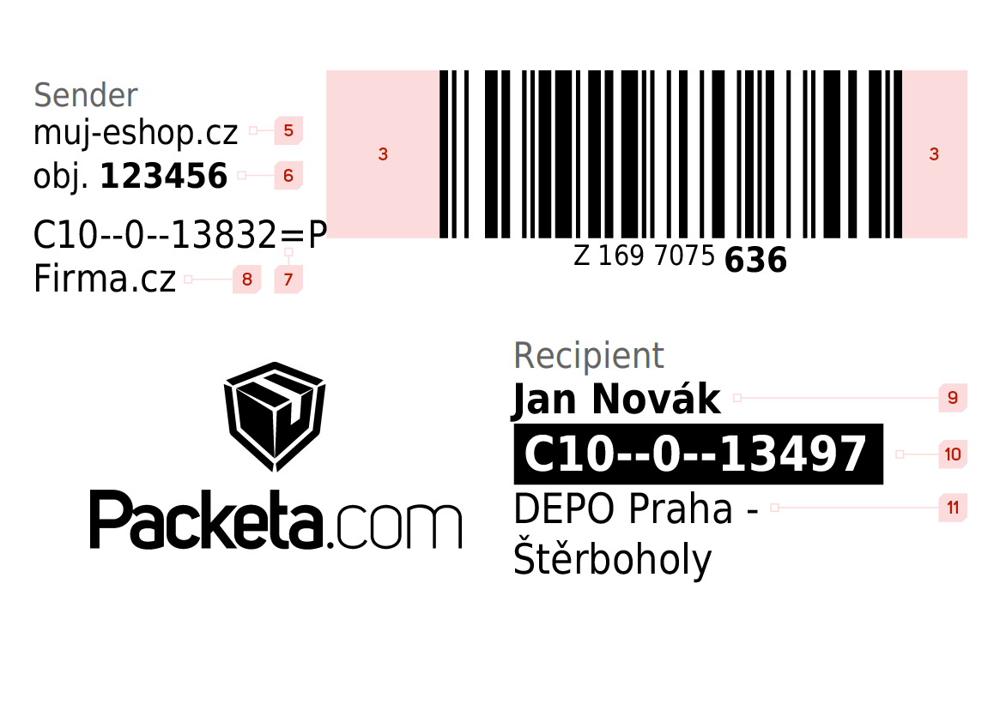
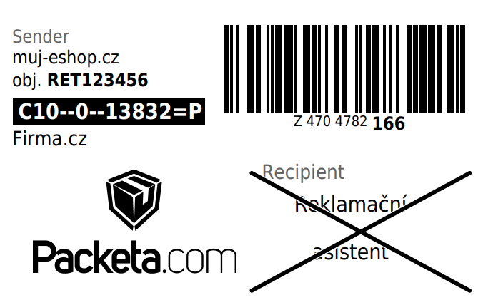

# Creating own packet label

In case you decide to print your own packet labels, it is necessary to state all of the basic information.

## Regular packet

### Logo and barcode

1. It is essential that the Packeta logo is visibly displayed on the label. In order to obtain Packeta logo, please contact one of our sales managers.
2. Tracking code is displayed as a barcode using **Code 128** symbology. To create the barcode use the tracking code in following format: `Z1234567890`.
3. Around the barcode there must to be a **quiet zone**. Which is a strip of white space at both sides of the barcode. Make sure the last line of your barcode isn't placed too close to the edge of the paper. The quiet zone should be at least as wide as 10 times the thinnest line of the barcode (usually 0.5 cm to 1 cm). For more information on quiet zones, see [this link](https://barcode-labels.com/why-are-quiet-zones-so-important/).
4. Text form of the tracking code in the `Z 000 0000 000` format must be placed beneath the barcode and the last three digits must be visibly bigger than the rest of the number.

### Sender

5. Eshop name.
6. Eshop's number of order.
7. Routing codes for returning packets. It is a pair of strings separated by a new line. The code is used to navigate the packet correctly in case of its return. They are generated dynamically by our system, based on invoicing address used for the eshop. It is possible to get those strings from API by calling [`senderGetReturnRouting()`](../api-reference/api-methods-reference#sendergetreturnrouting) method.
8. Billing address name.

### Recipient

9. Name and Surname
10. Routing code of destination branch/external carrier printed **white on black**. Routing code can be obtained from [branches export](../pick-up-point-selection/branch-export-v5) as `labelRouting` of the destination branch.
11. Name of branch. In [branches export](../pick-up-point-selection/branch-export-v5) it is the `nameStreet` property of the destination branch.

## Label for "Claim Assistant" packets

In case that you use Claim Assistant service and you print these labels by yourself, compared to usual labels it is necessary to substitute the address of **sender** by inscription **Claim Assistant** which should be crossed out and clearly visible.

## Direct printing for external carrier

In case that you decide to directly print external carriers label, you need to follow these steps:

1. Create packet by using method [createPacket()](../api-reference/api-methods-reference#createpacket).
2. Obtain packets tracking code by using method [packetCourierNumber()](../api-reference/api-methods-reference#packetcouriernumber).
3. Print packets external carrier label by using one of these methods: [packetCourierLabelPng()](../api-reference/api-methods-reference#packetcourierlabelpng), [packetCourierLabelPdf()](../api-reference/api-methods-reference#packetcourierlabelpdf), [packetCourierLabelsPdf()](../api-reference/api-methods-reference#packetcourierlabelspdf), [packetCourierLabelsZpl()](../api-reference/api-methods-reference#packetcourierlabelzpl).

